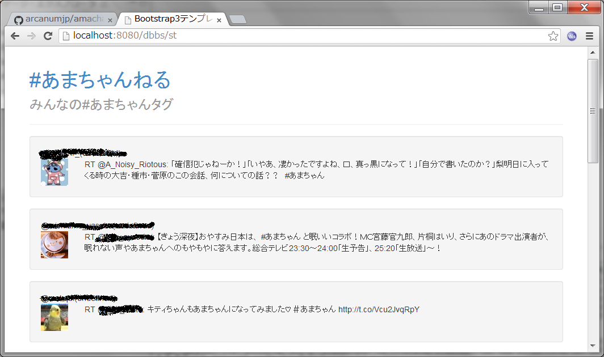

amachannel
==========

ツイッターの”あまちゃん”で取得できる結果をストリーミング表示するWebアプリ

TwitterのStreaming-APIの結果をWebSocketでクライアントに出力しています。

内部のトラックする文字列を変えればほかのストリーミングのWebアプリになります。また、余計なライブラリ等入っていますが、気になる方はそこはご自分で何とかしてください

テストケースとして作っていましたが不要になりましたので公開しています。ソースは恐ろしく汚いですよ。

